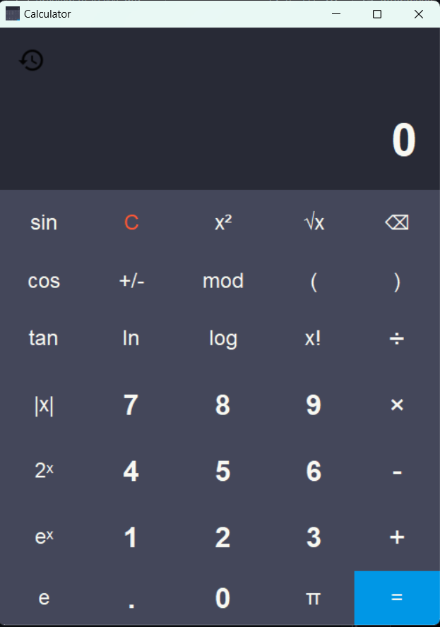

# Simple Calculator

This repository contains as simple implementation of a calculator with Python using [tkinter](https://docs.python.org/3/library/tkinter.html).

## Demo

<div style="text-align: center;">
    
</div>

## Installation
1. Clone this repository

```sh
git clone https://github.com/abel-shimeles/simplecalculator.git
```

2. Go to the installed directory
   
```sh
cd simplecalculator
```

3. Run the [main.py](main.py) file by running the following command
   
```sh
python main.py
```


